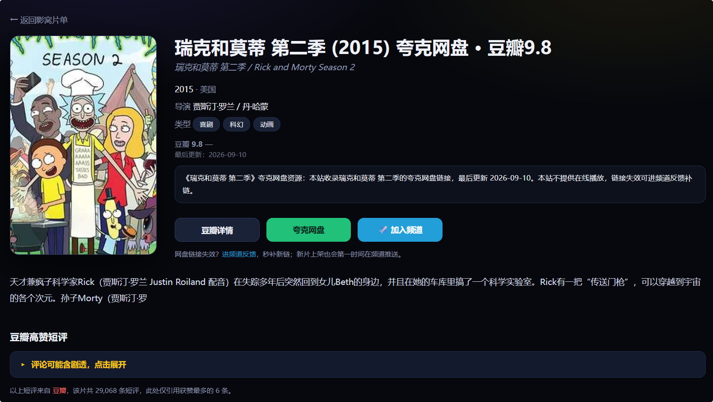

# Movie List Site Generator

A **zero-framework, zero-backend** static site generator for movie/TV collections. Feed it a CSV, and it outputs:

- A dark streaming-style homepage (card grid + search / filter / sort + hover-to-preview synopsis)
- A dedicated detail page per title (unique `<title>` / `description` / JSON-LD `Movie` schema + internal linking)
- `sitemap.xml`, `robots.txt`, `llms.txt` / `llms-full.txt` (SEO & AI-search-engine friendly)
- Category landing pages (by genre / region / year), plus `about.html`, `faq.html`, `404.html`

This repo ships **only the code and toolchain** — the sample data uses placeholder links. Keep your own list (with real cloud-drive links) local and out of the repo.

> ⚠️ Content notice: This is an **index only**. It does not host or stream anything. All links are collected from the web for personal study and reference — please support official releases. The repo contains no copyrighted material.

[简体中文](README.md) | **English**

---

## Screenshots

> These screenshots are from the live deployment at `https://movie.dingpin.app`. This repo only ships sample data.

**Homepage**


**Detail page**



---

## Quick Start

```bash
# 1. Set up Python (3.10+ required)
python -m venv .venv && source .venv/bin/activate      # Windows: .venv\Scripts\activate
pip install -r requirements.txt

# 2. Prepare your list
#    Copy the sample and fill in your own data:
cp data/example_movie_master.csv data/movie_master.csv
#    (edit with any text editor or Excel — see "Data Format" below)

# 3. Drop posters into assets/posters/, named <Douban subject id>.webp
#    e.g. assets/posters/1292052.webp (optional — generation works without them)

# 4. Generate the site
python gen_site.py
#   Output lands in site/

# 5. Preview locally
cd site && python -m http.server 8080
#   Open http://localhost:8080
```

Override defaults with environment variables:

| Variable | Description | Default |
|---|---|---|
| `MOVIE_SRC` | Path to your CSV | `data/movie_master.csv` |
| `MOVIE_OUT` | Output directory | `site/` |
| `SITE_TITLE` | Site title | `Movie List (Sample)` |
| `SITE_DESC` | Site description (SEO) | see source |
| `SITE_URL` | Your domain (with trailing `/`) | `https://your-domain.example/` |
| `GSC_CODE` | Google Search Console verification code (empty = omitted) | empty |
| `BING_CODE` | Bing Webmaster verification code | empty |
| `TG_URL` | Telegram channel link (empty = hidden) | `https://t.me/your_channel` |
| `CF_ANALYTICS` | Cloudflare Web Analytics snippet (empty = no analytics) | empty |

Example:

```bash
SITE_URL="https://your-site.pages.dev/" SITE_TITLE="My List" python gen_site.py
```

---

## Data Format

The CSV's **first row is a header**, with 18 fixed columns:

| # | Column | Description |
|---|---|---|
| 1 | Title | Display title |
| 2 | Original title | Original-language title |
| 3 | Year | Number, e.g. `2023` |
| 4 | Genre | Separated by `、`, e.g. `Drama、Crime` |
| 5 | Country | e.g. `USA` |
| 6 | Region | For categorization, e.g. `Western` / `Japan` |
| 7 | Director | Multiple separated by `、` |
| 8 | My rating | Use `—` if unrated |
| 9 | Douban rating | e.g. `9.4` |
| 10 | Delisted | `no` / `yes` |
| 11 | Douban link | `https://movie.douban.com/subject/<id>/` |
| 12 | Poster | Path, e.g. `assets/posters/1292052.webp` |
| 13 | Baidu drive link | Leave empty if none |
| 14 | Baidu access code | Pairs with column 13 |
| 15 | Quark drive link | Leave empty if none |
| 16 | Synopsis | Shown on the detail page |
| 17 | Xunlei drive link | Leave empty if none; if it contains `?pwd=`, column 18 is unnecessary |
| 18 | Xunlei access code | Leave empty when the link already has `?pwd=` |

> A row needs at least one of Baidu / Quark / Xunlei, otherwise it is skipped (no page generated).

---

## Directory Structure

```
movie-list-site/
├── gen_site.py              # Core generator
├── comments.js              # Client-side script for the detail-page comment area
├── requirements.txt
├── README.md                # 简体中文
├── README_EN.md             # English
├── LICENSE
├── .gitignore
├── .github/
│   └── workflows/deploy.yml # GitHub Actions → Cloudflare Pages
├── data/
│   └── example_movie_master.csv   # Sample list (4 rows, placeholder links)
├── assets/
│   └── posters/             # Your posters (git-ignored)
└── douban_export/          # Data maintenance toolchain
    ├── add_single.py        # Add one title (auto-fetches Douban metadata)
    ├── add_batch.py         # Batch import
    ├── fetch_comments.py    # Cache top Douban short reviews
    ├── _check_sids.py       # Validate subject id + duplicate check
    ├── _fix_intro.py        # Fill / rewrite synopsis
    └── push_tg.py           # Push copy to a Telegram channel (needs --token)
```

### Toolchain Notes

Scripts under `douban_export/` are everyday maintenance helpers; most hit the Douban API over the network:

- `add_single.py <douban_sid> [quark_link] [--baidu link --pwd code] [--xunlei link --xpwd code]` — add one title.
- `_check_sids.py <sid,...>` — validate ids, print metadata, and detect duplicates (**never auto-overwrite a hit**).
- `fetch_comments.py --sids <sid,...>` — fetch top reviews into `data/comments_cache.json`.
- `push_tg.py --token <BOT_TOKEN> --chat <channel> --file copy.md` — post copy to Telegram.

> No Douban cookies or Telegram tokens are stored in this repo. Configure your own network and credentials to use them.

---

## Automatic Deployment (GitHub Actions)

A ready-made workflow lives at `.github/workflows/deploy.yml`. It runs in two stages:

- **build (always runs)**: generates the static site and uploads it as an artifact. Succeeds even with no Cloudflare credentials configured.
- **deploy (on demand)**: only runs when the `CLOUDFLARE_PROJECT_NAME` **Variable** is set; otherwise it is skipped automatically so the whole pipeline stays green.

It triggers on every push to `main`, or you can run it manually from the Actions tab.

**1. Add Secrets** (Settings → Secrets and variables → Actions → Secrets):

| Secret | Required | Description |
|---|---|---|
| `CLOUDFLARE_API_TOKEN` | Yes | Cloudflare API token with Pages edit permission |
| `CLOUDFLARE_ACCOUNT_ID` | Yes | Your Cloudflare Account ID |
| `MOVIE_CSV_B64` | No | Base64 of your real CSV — keeps it out of the repo |
| `GSC_CODE` / `BING_CODE` | No | Search-console verification codes |
| `CF_ANALYTICS` | No | Cloudflare Web Analytics snippet |

**2. Add Variables** (same page → Variables tab):

| Variable | Required | Description |
|---|---|---|
| `CLOUDFLARE_PROJECT_NAME` | Yes | Pages project name, e.g. `yingwo` |
| `SITE_TITLE` / `SITE_DESC` / `SITE_URL` / `TG_URL` | No | Site metadata |

**3. Encode your CSV as a secret** (keeps real links out of git):

```bash
# macOS / Linux
base64 -i data/movie_master.csv | pbcopy     # or: base64 -w0 data/movie_master.csv

# Windows PowerShell
[Convert]::ToBase64String([IO.File]::ReadAllBytes("data\movie_master.csv")) | Set-Clipboard
```

Paste the result as the `MOVIE_CSV_B64` secret. If it is not set, the build falls back to the bundled sample data.

---

## Deploy to Cloudflare Pages (manual)

**Option A: from your machine (simplest)**

```bash
# Requires Node.js + wrangler
npm install -g wrangler
wrangler pages deploy site --project-name <your-project> --branch main
# Sign in to Cloudflare when prompted
```

**Option B: connect Git in the Cloudflare dashboard**

Use "Connect to Git" and set:

- Build command: `python gen_site.py`
- Build output directory: `site`
- Environment variables: `MOVIE_SRC=data/movie_master.csv` (others optional)

---

## License

[MIT](LICENSE) — fork, modify, self-host, or republish freely.
